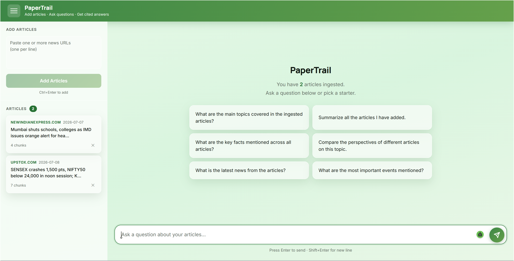

<div align="center">

# 📰 PaperTrail

### Multi-Article RAG Research Assistant

**Paste news URLs. Ask questions. Get cited, streamed answers.**

[](https://python.org)
[](https://fastapi.tiangolo.com)
[](https://react.dev)
[](https://weaviate.io)
[](https://groq.com)
[](LICENSE)

[](https://paper-trail-sigma-ten.vercel.app/)
[](https://paper-trail-g0xr.onrender.com/docs)

</div>

---

## 📸 Demo



> **Drop any news URL → ask anything → get a grounded, cited answer streamed in real time.**

---

## ✨ Features

| Feature | Description |
|---------|-------------|
| 📎 **Paste & Ask** | Drop any news URL and start chatting immediately |
| 🔍 **Hybrid Search** | BM25 + dense vector retrieval via Weaviate for high recall |
| 🎯 **Cross-Encoder Reranking** | ms-marco-MiniLM reranks top 24 candidates → top 6 |
| ⚡ **SSE Streaming** | Answers stream token-by-token via Server-Sent Events |
| 🔗 **Source Citations** | Every answer links back to the exact article |
| 📚 **Multi-Article Chat** | Ingest multiple articles and filter by source |
| 🧠 **Intent Routing** | Summary/comparison queries routed to a stronger model |
| 🔒 **Session Isolation** | Fresh start on every server restart, no stale data |

---

## 🏗️ Architecture

```
┌─────────────────────────────────────────────────────────────────┐
│                        INGESTION PIPELINE                        │
│                                                                  │
│   News URL ──► Scrape ──► Chunk ──► Embed ──► Weaviate Index    │
│               (trafilatura) (~300 tok) (BGE-small)  (HNSW+BM25) │
└─────────────────────────────────────────────────────────────────┘

┌─────────────────────────────────────────────────────────────────┐
│                         QUERY PIPELINE                           │
│                                                                  │
│   Question ──► Intent ──► Embed ──► Hybrid Retrieve ──► Rerank  │
│               Detect    (BGE)     (BM25 35%+HNSW 65%)  (Cross-  │
│                                        top 24           encoder) │
│                                                            │      │
│                                                         Groq LLM │
│                                                            │      │
│                                                     Streamed SSE  │
│                                                       Answer      │
└─────────────────────────────────────────────────────────────────┘
```

### Pipeline Steps

| Step | Tool | Detail |
|------|------|--------|
| 🕷️ Scrape | trafilatura | Extracts clean article text from any news URL |
| ✂️ Chunk | Sentence-boundary | ~300 tokens / 1200 chars per chunk, with section labels |
| 🔢 Embed | BAAI/bge-small-en-v1.5 | 384-dim dense vectors via ONNX Runtime (fastembed) |
| 🗄️ Store | Weaviate | HNSW (ef=128) + BM25 (k1=1.5, b=0.4) dual index |
| 🔍 Retrieve | Hybrid | alpha=0.65 dense + 0.35 BM25, top 24 candidates |
| 🌐 Diversify | Custom | Max 3 chunks per article to prevent flooding |
| 🎯 Rerank | ms-marco-MiniLM-L-6-v2 | Cross-encoder scores, keeps top 6 |
| 💬 Generate | Groq API | Llama 3.3 70B / DeepSeek-R1, SSE streaming |

---

## 🛠️ Tech Stack

<div align="center">

| Layer | Technology |
|-------|-----------|
| **Frontend** | React 18 + Vite + CSS Modules |
| **Backend** | FastAPI + Python 3.10+ |
| **Vector DB** | Weaviate Cloud (HNSW + BM25) |
| **Embeddings** | BAAI/bge-small-en-v1.5 (fastembed / ONNX) |
| **Reranker** | ms-marco-MiniLM-L-6-v2 (fastembed / ONNX) |
| **LLM** | Groq API — Llama 3.3 70B + DeepSeek-R1 |
| **Scraper** | trafilatura |
| **Metadata DB** | SQLite |

</div>

---

## 📁 Project Structure

```
paper-trail/
├── 📂 backend/
│   ├── main.py            # FastAPI app — all endpoints
│   ├── scraper.py         # Article scraping with trafilatura
│   ├── chunker.py         # Sentence-boundary text chunking
│   ├── embedder.py        # BAAI/bge-small-en-v1.5 via fastembed
│   ├── retriever.py       # Hybrid search + cross-encoder reranking
│   ├── llm.py             # Groq SSE streaming
│   ├── database.py        # SQLite article tracking
│   ├── query_processor.py # Intent detection + starter questions
│   ├── eval_ragas.py      # RAGAS-style LLM-as-judge evaluation
│   └── requirements.txt
├── 📂 frontend/
│   ├── src/
│   │   ├── App.jsx
│   │   ├── components/
│   │   │   ├── Sidebar.jsx      # Article manager + URL ingest
│   │   │   ├── Message.jsx      # Chat bubbles with markdown
│   │   │   ├── InputBar.jsx     # Question input + send
│   │   │   ├── Welcome.jsx      # Empty state + starter cards
│   │   │   └── SourceChips.jsx  # Cited source links
│   │   ├── hooks/useChat.js     # SSE streaming hook
│   │   └── utils/markdown.js
│   ├── index.html
│   └── vite.config.js
├── docker-compose.yml           # Local Weaviate
└── 📂 docs/
    └── Application-Snapshot.png
```

---

## 🚀 Quick Start

### Prerequisites

- Python 3.10+
- Node.js 18+
- Docker Desktop
- Groq API key — free at [console.groq.com](https://console.groq.com)

---

### Step 1 — Start Weaviate

```bash
docker-compose up -d
```

> Weaviate runs on `http://localhost:8080`. Data persists in a Docker volume.

---

### Step 2 — Backend

```bash
cd backend
python -m venv .venv
```

<details>
<summary><b>Activate virtual environment</b></summary>

**PowerShell:**
```powershell
Set-ExecutionPolicy -Scope Process -ExecutionPolicy RemoteSigned
.venv\Scripts\Activate.ps1
```

**Command Prompt:**
```cmd
.venv\Scripts\activate.bat
```

**macOS / Linux:**
```bash
source .venv/bin/activate
```
</details>

```bash
pip install -r requirements.txt
cp .env.example .env
```

Edit `.env`:
```env
GROQ_API_KEY=your_groq_api_key_here
WEAVIATE_URL=http://localhost:8080
```

```bash
python -m uvicorn main:app --host 0.0.0.0 --port 8000
```

---

### Step 3 — Frontend

```bash
cd frontend
npm install
npm run dev
```

Open **[http://localhost:5173](http://localhost:5173)**

---

## 💡 Usage

```
1. Paste one or more news article URLs in the left sidebar
         │
         ▼
2. Click "Add Articles" — scraped, chunked & indexed in seconds
         │
         ▼
3. Type any question in the input bar
         │
         ▼
4. Get a streamed, cited answer with clickable source links
```

> 💡 Use the **starter question cards** on the welcome screen for inspiration.

---

## 🔌 API Reference

Base URL: `https://paper-trail-g0xr.onrender.com`  
Interactive docs: [`/docs`](https://paper-trail-g0xr.onrender.com/docs)

| Method | Endpoint | Description |
|--------|----------|-------------|
| `POST` | `/ingest` | Scrape and index article URLs |
| `POST` | `/query` | Stream an SSE answer |
| `GET` | `/articles` | List all ingested articles |
| `DELETE` | `/articles/{doc_id}` | Remove an article |
| `GET` | `/starters` | Starter questions for the UI |
| `GET` | `/health` | Health check + Weaviate status |

<details>
<summary><b>Example: Ingest an article</b></summary>

```bash
curl -X POST https://paper-trail-g0xr.onrender.com/ingest \
  -H "Content-Type: application/json" \
  -d '{"urls": ["https://www.bbc.com/news/articles/example"]}'
```

Response:
```json
{
  "results": [{
    "url": "https://...",
    "status": "ok",
    "doc_id": "2b32ba4b-...",
    "title": "Article Title",
    "chunks": 14
  }]
}
```
</details>

<details>
<summary><b>Example: Ask a question</b></summary>

```bash
curl -X POST https://paper-trail-g0xr.onrender.com/query \
  -H "Content-Type: application/json" \
  -d '{"question": "What happened?", "history": [], "doc_ids": []}'
```

Response: SSE stream of `data: {"type": "token", "text": "..."}` events.
</details>

---

## 📊 Evaluation Results

Run the RAGAS-style evaluation (requires articles ingested first):

```bash
cd backend
python eval_ragas.py
```

Groq acts as LLM judge across three metrics:

| Metric | What It Measures |
|--------|-----------------|
| 🎯 **Faithfulness** | Answer is grounded in retrieved chunks — no hallucination |
| 💬 **Answer Relevancy** | Answer directly addresses the question |
| 🔍 **Context Precision** | Retrieved chunks are relevant to the question |

**Sample results (2 articles ingested):**

```
Question                                   Faith  Relev   Prec
──────────────────────────────────────────────────────────────
Why did Sensex crash 1500 points?          1.00   1.00   0.83
Which stocks were buzzing during crash?    1.00   1.00   0.83
What happened to Kalyan Jewellers stock?   1.00   1.00   0.83
Why did Mumbai shut schools?               1.00   1.00   1.00
──────────────────────────────────────────────────────────────
Overall RAG Score  ████████████████████  0.905
```

---

## ☁️ Deployment

| Service | Platform | Status |
|---------|----------|--------|
| 🌐 Frontend | [Vercel](https://paper-trail-sigma-ten.vercel.app/) | [](https://paper-trail-sigma-ten.vercel.app/) |
| ⚡ Backend | [Render](https://paper-trail-g0xr.onrender.com) | [](https://paper-trail-g0xr.onrender.com/health) |
| 🗄️ Vector DB | Weaviate Cloud | Serverless Sandbox |

### Environment Variables (Render)

```env
GROQ_API_KEY=your_groq_key
WEAVIATE_URL=https://your-cluster.weaviate.network
WEAVIATE_API_KEY=your_weaviate_key
```

> ⚠️ **Weaviate free tier** pauses after 14 days of inactivity. Resume it from the [Weaviate Cloud dashboard](https://console.weaviate.cloud) if you get a 503 error.

---

## 🛑 Stopping Local Services

```bash
# Stop Weaviate
docker-compose down

# Wipe all data (removes weaviate_data volume)
docker-compose down -v
```

---

<div align="center">

Made with ❤️ using FastAPI, React, Weaviate, and Groq

⭐ **Star this repo if you found it useful!**

</div>
